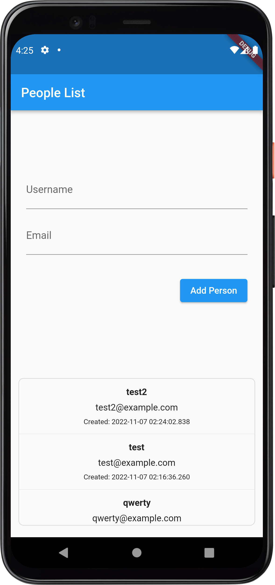

# back4app_test_flutter


## Setup

After clone this repository,

```sh
cp .env.default .env
```

Set `BACK4APP_APPLICATION_ID` and `BACK4APP_CLIENT_KEY` in `.env`.  
(Ref: https://www.back4app.com/docs/react/quickstart )

Then, install dependencies.

```sh
flutter pub get
```


## Run

```sh
flutter run
```

<p align="center">
    
</p>
